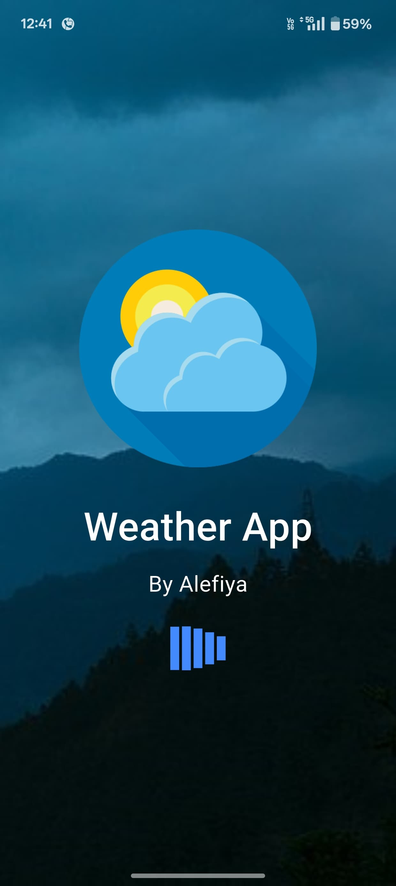
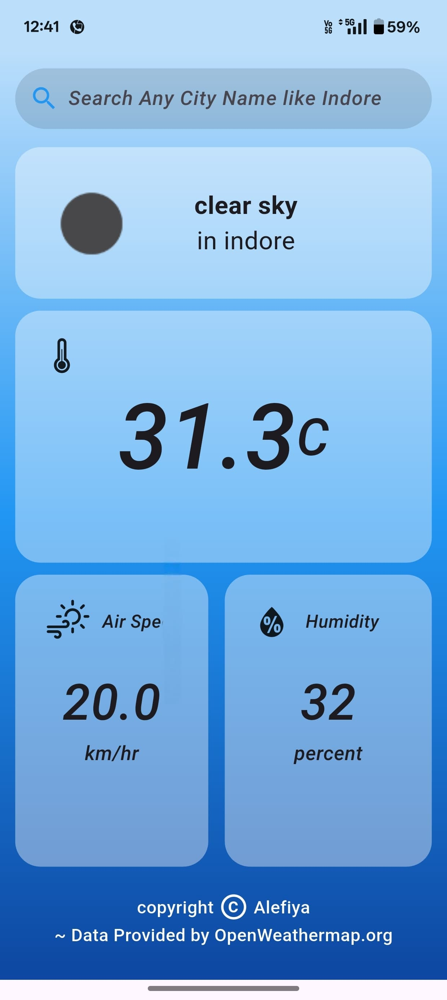

# 🌦️ Weather App

A beautiful and simple weather forecasting app built with **Flutter** that provides real-time weather updates for any location. This app is designed with a clean UI and accurate data to help users plan their day better.

---

## 📱 Features

- 🔍 Search weather by city name
- 📍 Get current location weather
- 🌡️ Real-time temperature, humidity, and wind speed
- 🌦️ Weather icons and descriptions
- 🕒 Last updated timestamp
- 🔄 Pull to refresh

---

## 🛠️ Tech Stack

- **Flutter** – UI development
- **Dart** – Programming language
- **OpenWeatherMap API** – Weather data
- **Geolocator** – For getting user location
- **HTTP** – API calls

---

## 📸 Screenshots

| Loading or Splash Screen | Home Screen |
|-------------|----------------|
|  |  |


---

## 🚀 Getting Started

### Prerequisites
- Flutter SDK
- A device/emulator
- OpenWeatherMap API key (free)

### Clone the repo

```bash
git clone https://github.com/<your-username>/weather-app.git
cd weather-app
